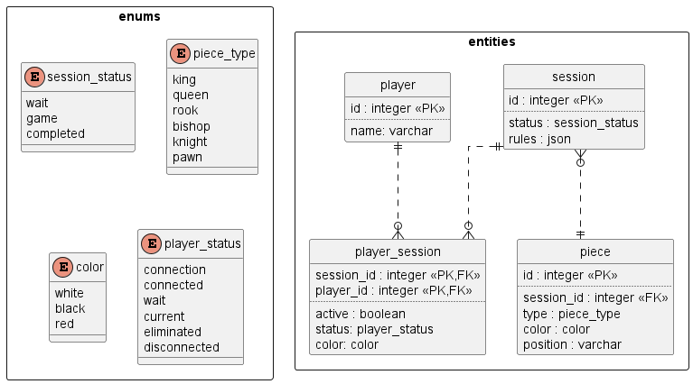

## История изменений

- 1.0.0 -  первоначальный вариант.

## Открытые вопросы

- Местонахождение модуля в архитектуре системы:
  - `tcp-core`;
  - отдельный микросервис.
- Хранение данных:
  - общая с `tcp-core` база данных;
  - отдельная база данных.

# Общие положения

Требуется создать модуль, реализующий создание игровой сессии и взаимодействие с шахматной доской с учетом всех правил, привязанных к игровой сессии. Для взаимодействия с модулем требуется разработать API.

# Требования, ограничения и допущения

## EPIC: Создание модуля для управления игрой "Шахматы на троих"

Требуется реализовать модуль позволяющий создавать и манипулировать шахматной доской для игровой сессии. 

Модуль должен быть реализован в виде [сервисного слоя](https://habr.com/ru/post/581964/) в `tpc-core`.

### STORY: Создание игровой сессии

- Требуется возможность создать игровую сессию при помощи API с возможностью конфигурировать набор правил.
- Требуется провести анализ всех возможных возможных правил (в том числе и ниже перечисленные) с целью реализовать их внутри системы; примеры опций для настроек правил:
  - форма доски:
    - четырехугольные клетки;
    - треугольные клетки;
    - гексагональные клетки;
  - правила ходов:
    - как ходят те или иные фигуры;
    - правила взаимодействия с другими фигурами;
  - наличие дополнительных механик:
    - рокировка;
    - повышение;
  - условия победы:
    - по таймеру (при его наличии);
    - до первого мата или до последнего.
- Создание игровой сессии подразумевает также создание привязанной к ней шахматной доски с базовой расстановкой фигур в соответствии с правилами.

### STORY: Информация об игровой сессии

- Требуется возможность определения состояния игровой сессии; состояния игровой сессии:
  - ожидание готовности игроков;
  - игра;
  - завершено.
- Требуется возможность определения состояния участников игровой сессии; состояния участников:
  - подключение;
  - подключен;
  - ожидание хода;
  - ходит;
  - выбыл;
  - отключен.

### STORY: Информация шахматной доске

- Требуется возможность определения информации о шахматных фигурах на шахматной доске:
  - типа фигуры
    - король;
    - ферзь;
    - ладья;
    - слон;
    - конь;
    - пешка;
  - координаты каждой фигуры хранятся в виде пары значений: 
    - буква (A-L);
    - цифры (1-12);
  - фигура обладает одним из 3 цветов:
    - белый;
    - черный;
    - красный;
  - фигура может быть на доске или съеденной; во втором случае координаты заменяются на `null `.
- Требуется возможность нахождения всех возможных ходов для любой фигуры при любой расстановке фигур на доске для каждого набора правил.
- Требуется возможность определения всех шахов и матов.

### STORY: Взаимодействие с шахматной доской

- Требуется возможность изменять положение фигуры на доске.
- При запросе на перемещение фигуры должна проходить валидация хода в соответствии с игровыми правилами.

### STORY: Внутреннее управление игровой сессией

- Требуется реализовать в соответствии с игровыми правилами поведение фигур для ходов с поеданием.
- Требуется реализовать в соответствии с игровыми правилами поведение фигур для ходов с рокировкой.
- Требуется реализовать в соответствии с игровыми правилами поведение фигур для ходов с повышением.
- Требуется реализовать в соответствии с игровыми правилами поведение фигур для ходов с матом.

## EPIC: Взаимодействие с базой данных

Данные, фигурирующие в движке, необходимо хранить в базе данных, используя СУБД. Требуется кодовая инфраструктура с использованием orm средств для взаимодействия с СУБД. Требуется автоматическая [миграция](https://docs.djangoproject.com/en/4.1/topics/migrations/) базы данных при запуске сервиса.

### STORY: Модель базы данных

- Требуется составить модель реляционной базы данных, используя СУБД.
- ER-диаграмма базы данных:

- Ограничения:
  - `session`:
    - `status` not null;
    - `rules` not null;
  - `piece`:
    - `session_id` not null;
    - `type` not null;
    - `color` not null;
  - `player`:
    - `name` not null, unique;
  - `player_session`:
    - `active` not null;
    - `status` not null;
    - `color` not null;
    - (`player_id`, `active`) unique.
- Представить модель базы данных в формате, который можно использовать для миграции; требуется исключить конфиденциальные данные из файлов (логины, пароли и т.д.).

### STORY: Миграция базы данных

- Требуется реализовать функцию миграцию базы данных при запуске сервиса.
- Параметры подключения к СУБД должна храниться в отдельном конфигурационном файле; требуется исключить конфиденциальные данные.
- Требуется обеспечить в файловой инфраструктуре проекта возможность отслеживания изменений в базе данных.

### STORY: Представление сущностей

- Требуется реализация структур внутри проекта, при помощи которых должны отображаться объекты базы данных.
- Зависимость от enum-типов также должна отображаться внутри 
- Данные, которые должны быть отображены в структурах для отдельных сущностей:
  - `player`:
    - `id`;
    - `name`;
    - информация об активной `session`:
      - `session`;
      - `status`;
      - `color`;
  - `session`:
    - `status`;
    - `rules` (данные в формате ключ/значение);
    - список всех относящихся `piece`;
  - `piece`:
    - `type`;
    - `color`;
    - `position`.

### STORY: Чтение и запись данных данных

- Для каждой сущности (кроме интерсекций) требуется реализовать репозитории для операций при помощи СУБД.
- Операции, которые должны поддерживаться репозиториями для отдельных сущностей:
  - `player`:
    - поиск всех значений;
    - поиск по `id`;
    - поиск по `session_id`;
    - добавление;
    - обновление по `id`;
    - удаление по `id`;
  - `session`:
    - поиск всех значений;
    - поиск по `id`;
    - добавление;
    - обновление по `id`;
    - удаление по `id`;
  - `piece`:
    - поиск всех значений;
    - поиск по `id`;
    - поиск по `session_id`;
    - добавление;
    - обновление по `id`;
    - удаление по `id`.
- Операции чтения должны возвращать результат, представленный в виде выше описанных структур.
- Для операций создания и обновления возможны дополнительные сокращенные отображения сущностей, если это требуется.
