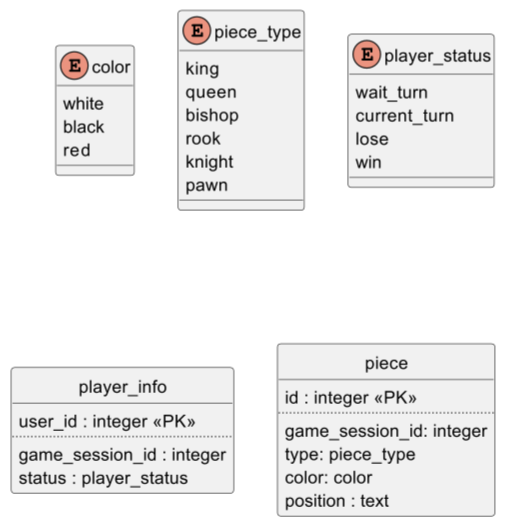

## История изменений

- 1.0.0 - первоначальный вариант.
- 1.1.0 - добавлены условия обновления данных по вебсокетам.
- 1.2.0 - фиксы названий, доработка ERD.
- 1.3.0 - переработка спецификации Lobby вебсокета.

## Открытые вопросы

- Как лучше реализовать перечисляемые значения (статусы, цвет и тип фигур):
  - `enum` типы данных, предоставляемые СУБД (пример на ERD);
  - `text` тип данных?
- Как лучше реализовать игровые данные?

# Общие положения

Требуется реализовать веб-интерфейсы сервера для обеспечения потока информации.

# Требования, ограничения и допущения

## EPIC: Модель данных

Все изменения, касаемые обеспечения потока информации, должны придерживаться единой модели данных.

### STORY: База данных

- Основные редко обновляемые данные должны храниться и обрабатываться с использованием СУБД Postgres
- Для взаимодействия с СУБД предпочтительно использовать средства ORM Django
  - Рекомендуется использовать встроенную в Django сущность `user` и соответствующий инструментарий для аутентификации пользователей
- С использованием ORM Django реализовать миграции баз данных

### STORY: Игровые данные

- Часто обновляемые данные, связанные с игровой сессией, требуется хранить и обрабатывать с использованием хэш-мапы, где ключом соответствует `id` у `game_session` (требуется реализация сервиса для управления этими данными).

## EPIC: Взаимодействие с серверной частью

Требуется реализация API серверной части, используя инструментарий Django. 

API подразделяется на 2 части:

- Rest (для однократных запросов и получения статичных данных)
- Websocket (для частого отправления запросов и получения постоянно обновляемых данных)

При этом все данные, передаваемые сервером при помощи вебсокетов, должны быть постоянно актуализированы для получателей. Иными словами, если на сервере произошло редактирование данных, вебсокет, предназначенный для передачи этих данных, должен передать получателям обновленные данные.

### STORY: Аутентификация

Требуются Rest контроллеры для следующих действий:

- Аутентификация пользователя
  - статус ответа должен соответствовать результату аутентификации
  - ответ должен содержать JWT-токен, сгенерированный в ходе успешной аутентификации аутентификации
- Регистрация пользователя
  - запрос создает на основе полученных данных:
    - `user`
      - `name = <received_name>`
      - `email = <received_email>`
      - `password = <received_password>`
    - `user_scores`
      - `scores = 0`
  - статус ответа должен соответствовать результату регистрации

### STORY: Список лобби

Требуется Websocket consumer для списка доступных лобби

- требуется аутентификация
- предоставляет следующие данные:
  - список доступных лобби, 
    - каждый элемент списка должен содержать следующие данные:
      - `game_session_id`
      - `players` (список имен, подключенных к данной `game_session`)
  
    - обновление списка должно происходить в случае изменения данных о каком-либо элементе:
      - при создании/удалении лобби
      - при изменении количества участников лобби
  
- лобби является доступным, если в нем меньше 3 участников

### STORY: Лобби

Требуется Websocket consumer для взаимодействия с лобби

- требуется аутентификация
- подключенным пользователям требуется предоставлять следующие данные:
  - информация об активной `game_session` 
    - уникально для каждого подключенного пользователя
    - `null`, если у пользователя нет активной `user_game_session`
    - обновление должно происходить при изменении статуса игровой сессии
  - список `user_gamer_session`, ссылающихся на активную `game_session`
    - уникально для каждого подключенного пользователя
    - `null`, если у пользователя нет активной `user_game_session`
    - обновление должно происходить при изменении информации о пользователей текущей сессии:
      - при добавлении/удалении пользователя
      - при изменении статуса пользователя
      - при изменении цвета пользователем
  - список `player_info`
    - уникально для каждого подключенного пользователя
    - `null`, если у пользователя нет активной `user_game_session`, у которой `status == game`
    - обновляется в случае изменения внутриигрового статуса
  - список `piece`
    - уникально для каждого подключенного пользователя
    - `null`, если у пользователя нет активной `user_game_session`, у которой `status == game`
    - обновляется при изменении данных фигуры:
      - тип
      - позиция
      - цвет
  - список доступных ходов
    - уникально для каждого подключенного пользователя
    - `null`, если у пользователя нет активной `user_game_session`, у которой `status == game` 
    - обновляется после каждого хода
- от подключенных требуется обрабатывать следующие запросы:
  - запрос на присоединение к лобби
    - если у подключаемой `game_session` `status == wait`
      - требуется отсутствие активной `game_session` у инициализатора
      - требуется у подключаемой `game_session` связанных `user_game_session` менее 3
      - при соблюдении всех вышеуказанных требований
        - создается `user_game_session`
          - `user_id = <current_user_id>`
          - `game_session_id = <connected_game_session_id>`
          - `active = true`
          - `status = not_ready`
          - `color = null`
          - `is_winner = null`
          - `scores = null`
          - `created_at = <current_timestamp>`
          - `updated_at = <current_timestamp>`
    - если у подключаемой `game_session` `status == game`
      - требуется наличие активной `game_session` у инициализатора
      - подключаемая `game_session` должна быть активной `game_session` у инициализатора
      - требуется `game_session.status == game`
      - при соблюдении всех вышеуказанных требований
        - `user_game_session.status = playing`
  - запрос на создание к лобби
    - требуется отсутствие активной `game_session` у инициализатора
    - при соблюдении вышеуказанного требования
      - создается `game_session`
        - `status = wait`
      - создается `user_game_session`
        - `user_id = <current_user_id>`
        - `game_session_id = <created_game_session_id>`
        - `active = true`
        - `status = not_ready`
        - `color = null`
        - `is_winner = null`
        - `scores = null`
        - `created_at = <current_timestamp>`
        - `updated_at = <current_timestamp>`
  - смена цвета фигур для текущего пользователя
    - требуется активная `user_gamer_session` у пользователя
    - требуется, чтобы полученное значение не совпадало со значениями у `user_game_session` привязанных к подключенной `game_session`
    - возможные значения:
      - white
      - black
      - red
    - при соблюдении всех вышеуказанных требований 
      - `user_game_session.color = <received_color>`
  - смена статуса о готовности для текущего пользователя
    - требуется активная `user_gamer_session` у пользователя
    - возможные значения:
      - ready
      - not_ready
    - при соблюдении всех вышеуказанных требований
      - `user_game_session.status = <received_status>`
  - запрос на передвижение фигуры
    - требуется активная `user_game_session` у пользователя
    - требуется `user_game_session.status == game`
    - требуется `player_info.status == current_turn`
    - требуется валидация хода в соответствии с правилами игры
    - при соблюдении всех вышеуказанных требований 
      - параметры связанных `piece` меняются в соответствии с правилами
      - параметры `player_info` меняются в соответствии с правилами
  - запрос сдаться
    - требуется активная `user_game_session` у пользователя
    - требуется `user_game_session.status == game`
    - при соблюдении всех вышеуказанных требований игра заканчивается
- при закрытии соединения:
  - если пользователь имеет активную `user_game_session` и `game_session.status == wait`
    - активная `user_game_session` удаляется
  - если пользователь имеет активную `user_game_session` и `game_session.status == game`
    - `user_game_session.status = disconnected`
- требуется обеспечить внутреннее поведение
  - если существует 0 `user_game_session` связанных с `game_session` 
    - `game_session` удаляется
  - `game_session.status = game`, если
    - существует 0 `user_game_session` связанных с `game_session`
    - все `user_game_session` связанные с `game_session` имеют статус `ready`
    - `game_session.status == wait`
  - если пользователь разрывает соединение
    - `user_game_session.status = disconnected`
  - если активная `user_game_session` имеет статус `disconnected` более 60 секунд
    - игра заканчивается
  - если активная достигаются условия победы
    - игра заканчивается
  - если игра закончилась
    - соответствующая `game_session` изменяется
      - `status = completed`
    - `user_game_session` связанные с `game_session` изменяются
      - `active = false`
      - `status = disconnected`
      - `is_winner = player_info.status`
      - `scores = <calculated_value>`
    - соответствующая `user_scores` изменяется
      - `scores = <calculated_value>`

### STORY: Рейтинговая таблица

Требуются Rest контроллер для получения рейтингового списка:

- ответ должен содержать сортированный по `scores` список, каждый элемент которого содержит:
  - `id`
  - `name`
  - `scores`

### STORY: Профиль

Требуются Rest контроллеры для следующих действий:

  - Информация о текущем пользователе
    - требуется аутентификация
    - ответ должен содержать следующие данные:
      - `id`
      - `name`
      - `scores`
      - `wins`
      - `loses`
  - История игровых сессий
    - требуется аутентификация
    - ответ должен
      - содержать сортированный по `id` по убыванию список, каждый элемент которого содержит:
        - `id`
        - `scores_diff`
        - `players` (список имен игроков, связанных c `game_session`)
