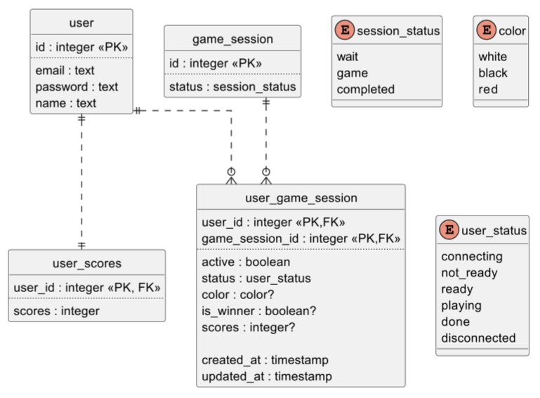

## История изменений

- 1.0.0 -  первоначальный вариант.
- 1.1.0 -  добавлены условия обновления данных по вебсокетам.
- 1.2.0 -  фиксы названий, доработка ERD.

## Открытые вопросы

- Как лучше реализовать перечисляемые значения (статусы, цвет и тип фигур):
  - `enum` типы данных, предоставляемые СУБД (пример на ERD);
  - `text` тип данных?
- Как лучше реализовать игровые данные?

# Общие положения

Требуется реализовать веб-интерфейсы сервера для обеспечения потока информации.

# Требования, ограничения и допущения

## EPIC: Модель данных

Все изменения, касаемые обеспечения потока информации, должны придерживаться единой модели данных.

### STORY: База данных

- Основные редко обновляемые данные должны храниться и обрабатываться с использованием СУБД Postgres
- Для взаимодействия с СУБД предпочтительно использовать средства ORM Django
  - Рекомендуется использовать встроенную в Django сущность `user` и соответствующий инструментарий для аутентификации пользователей
- С использованием ORM Django реализовать миграции баз данных

### STORY: Игровые данные

- Часто обновляемые данные, связанные с игровой сессией, требуется хранить и обрабатывать с использованием хэш-мапы, где ключом соответствует `id` у `game_session` (требуется реализация сервиса для управления этими данными).

## EPIC: Взаимодействие с серверной частью

Требуется реализация API серверной части, используя инструментарий Django. 

API подразделяется на 2 части:

- Rest (для однократных запросов и получения статичных данных)
- Websocket (для частого отправления запросов и получения постоянно обновляемых данных)

При этом все данные, передаваемые сервером при помощи вебсокетов, должны быть постоянно актуализированы для получателей. Иными словами, если на сервере произошло редактирование данных, вебсокет, предназначенный для передачи этих данных, должен передать получателям обновленные данные.

### STORY: Аутентификация

Требуются Rest контроллеры для следующих действий:

- Аутентификация пользователя
  - статус ответа должен соответствовать результату аутентификации
  - ответ должен содержать JWT-токен, сгенерированный в ходе успешной аутентификации аутентификации
- Регистрация пользователя
  - запрос создает на основе полученных данных:
    - `user`
      - `name = <received_name>`
      - `email = <received_email>`
      - `password = <received_password>`
    - `user_scores`
      - `scores = 0`
  - статус ответа должен соответствовать результату регистрации

### STORY: Список лобби

Требуется Websocket consumer для списка доступных лобби

- требуется аутентификация
- предоставляет следующие данные:
  - список доступных лобби, 
    - каждый элемент списка должен содержать следующие данные:
      - `game_session_id`
      - `players` (список имен, подключенных к данной `game_session`)
  
    - обновление списка должно происходить в случае изменения данных о каком-либо элементе:
      - при создании/удалении лобби
      - при изменении количества участников лобби
  
- лобби является доступным, если в нем меньше 3 участников

Требуются Rest контроллеры для следующих действий:

- Запрос на подключение в лобби
  - требуется аутентификация

  - запрос должен принимать параметр `game_session_id`

  - подключение возможно, если к данной `game_session` привязано меньше 3 `user_game_session` или текущий пользователь имеет соответствующую ему и данной сессии активную `user_game_session` (`active == true`); также подключаемый пользователь не должен иметь других активных `user_game_session`

  - при успешном подключении создается `user_gamer_session`

    - `user_id = <current_user_id>` 
    - `game_session_id = <connected_game_session_id>`
    - `active = true`
    - `status = connecting`
    - `color = null`
    - `is_winner = null`
    - `scores = null`
    - `created_at = <current_timestamp>`
    - `updated_at = <current_timestamp>`
  
  - статус ответа должен соответствовать результату подключения
- Запрос на создание игровой сессии
  - требуется аутентификация
  - создание лобби возможно, если инициатор не имеет других активных `user_game_session`
  - создается `game_session`

    - `status = wait` 
  - создается `user_game_session`
    - `user_id = <current_user_id>` 
    - `game_session_id = <created_game_session_id>`
    - `active = true`
    - `status = connecting`
    - `color = null`
    - `is_winner = null`
    - `scores = null`
    - `created_at = <current_timestamp>`
    - `updated_at = <current_timestamp>`
  - статус ответа должен соответствовать результату создания игровой сессии

### STORY: Лобби

Требуется Websocket consumer для взаимодействия с лобби

- требуется аутентификация
- соединение возможно, если для текущего пользователя существует активная `user_game_session`
- соединение хранит `id` соединенного пользователя и `id` ранее упомянутой `game_session`
- при успешном соединении `user_game_session.status = not_ready`
- требуется предоставлять следующие данные:
  - соответствующая `game_session`
    - обновление должно происходить при изменении статуса игровой сессии
  - список `user_gamer_session`, связанных с соответствующей `game_session`
    - обновление должно происходить при изменении информации о пользователей текущей сессии:
      - при добавлении/удалении пользователя
      - при изменении статуса пользователя
      - при изменении цвета пользователем
- требуется обрабатывать следующие запросы:
  - смена цвета фигур для текущего пользователя
    - для выбора доступны те цвета, которые не выбраны другими пользователями
  - смена статуса о готовности для текущего пользователя
    - должен приниматься параметр `user_status`
    - валидны только 2 статуса: `ready` и `not_ready`
- требуется обеспечить внутреннее поведение
  - `user_game_session`, имеющие статус connecting более 5 секунд, должны удаляться
  - в случае, если подключено 3 игрока, и каждый пользователь имеет статус `ready`, статус игровой сессии меняется на `game`, статус `user_game_session` меняется на `playing`
  - в случае, если подключено 0 игроков, `game_session` удаляется
- при закрытии соединения:
  - удаляется соответствующий `user_game_session`

### STORY: Игра

Если `game_session` находится в статусе `game`, функциональность websocket consumer для взаимодействия с лобби расширяется следующим образом:

- требуется предоставлять следующие данные:
  - список `player_info`
    - обновляется в случае изменения внутриигрового статуса
  - список `piece`
    - обновляется при изменении данных фигуры:
      - тип
      - позиция
      - цвет
  - список доступных ходов
    - обновляется после каждого хода
- требуется обрабатывать следующие запросы:
  - запрос на ход (передвижение фигуры)
    - требуется проверка, чей ход
    - требуется валидация хода в соответствии с правилами игры
    - в случае успеха внутриигровые данные изменяются в соответствии с правилами
  - запрос сдаться
    - игра заканчивается
- требуется обеспечить внутреннее поведение
  - требуется проверка положения фигур на доске на условия победы
    - проверка проводится после каждого хода
    - в случае победы игра заканчивается
  - в случае, если у одного из игроков разрывается соединения:
    - `user_game_session.status = disconnected`
  - если игрок подключается
    - `user_game_session.status = playing`
  - если `user_game_session.status == disconnected` более 60 секунд и `game_session.status == game`
    - игра заканчивается
  - в случае, если игра заканчивается:
    - `game_session.status = completed`
    - `user_game_session`
      - `active = false`
      - `status = disconnected`
      - `is_winner = player_info.status`
      - `scores = <calculated_value>`
    - `user_scores.scores = <calculated_value>`
    - закрываются все текущие соединения
- при закрытии соединения:
  - `user_game_session` не удаляется
  - `user_game_session.status = disconnected`

### STORY: Рейтинговая таблица

Требуются Rest контроллер для получения рейтингового списка:

- ответ должен содержать сортированный по `scores` список, каждый элемент которого содержит:
  - `id`
  - `name`
  - `scores`

### STORY: Профиль

- Требуются Rest контроллеры для следующих действий:

  - Информация о текущем пользователе

    - требуется аутентификация
    - ответ должен содержать следующие данные:
      - `id`
      - `name`
      - `scores`
      - `wins`
      - `loses`
  
  - История игровых сессий
  
    - требуется аутентификация
  
    - ответ должен 
  
      - содержать сортированный по `id` по убыванию список, каждый элемент которого содержит:
  
        - `id`
        - `scores_diff`
        - `players` (список имен игроков, связанных c `game_session`)
  
        
